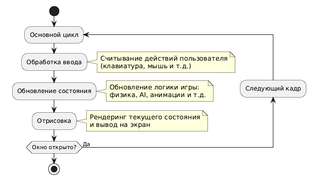

## Класс `Engine`: Основной цикл, ввод, обновление и отрисовка

Класс `Engine` является ядром 3D-движка. Он отвечает за управление основным циклом приложения, обработку ввода, обновление состояния игры и отрисовку сцены. Также он использует `delta time` для обеспечения плавной работы при разной производительности устройств, то есть, зависит от времени, а не от частоты обновления кадров.

#### Основной цикл
Основной цикл (game loop) — это сердце любого движка, позволяющий отрисовывать множество последовательных кадров, а также обрабатывать события на каждой итерации. Он выполняется непрерывно, пока приложение запущено, и состоит из трех основных этапов:
- **Обработка ввода** — считывание действий пользователя (клавиатура, мышь и т.д.).
- **Обновление состояния** — обновление логики игры (физика, AI, анимации и т.д.).
- **Отрисовка** — рендеринг текущего состояния игры и отрисовка на экран.



#### Delta Time
`Delta time` — это время, прошедшее между кадрами. Оно используется для обеспечения плавной работы на устройствах с разной производительностью. Например, если объект движется со скоростью 10 единиц в секунду, то за кадр он должен переместиться на `10 * deltaTime` единиц.

---

### Реализация

#### Структура `Engine`
```cpp
class Engine {
public:
    // Конструктор (Вызываем конструктор создания окна)
    Engine() : m_window(sf::VideoMode({1200, 800}), "3d render", sf::Style::Titlebar | sf::Style::Close) {} 

    // Основной цикл приложения
    void run() {
        // Таймер для измерения времени
        sf::Clock clock;
        // Время одного кадра
        sf::Time frameTime = sf::seconds(1.f / 60);

        // Время с последнего обновления FPS
        sf::Time elapsedTimeSinceLastUpdate = sf::Time::Zero;

        // Основной цикл
        while (m_window.isOpen()) {
            // Время, прошедшее с последнего кадра
            deltaTime = clock.restart();
            elapsedTimeSinceLastUpdate += deltaTime;

            // Обработка событий
            handleEvents();
            // Обновление состояния
            update();
            // Отрисовка сцены
            draw();

            // Ограничение FPS
            sf::Time elapsedTime = clock.getElapsedTime();
            if (elapsedTime < frameTime) {
                sf::sleep(frameTime - elapsedTime);
            }

            // Обновление заголовка окна (FPS)
            if (elapsedTimeSinceLastUpdate >= sf::seconds(0.05f)) {
                float fps = 1.f / deltaTime.asSeconds(); 
                m_window.setTitle("3d render - FPS: " + std::to_string(static_cast<int>(fps)));
                elapsedTimeSinceLastUpdate = sf::Time::Zero;
            }
        }
    }

private:
    // Окно приложения
    sf::RenderWindow m_window;
    // Время, прошедшее с последнего кадра
    sf::Time deltaTime;


    // Обработка событий
    void handleEvents() {
        // Обработка всех событий в очереди
        while (const std::optional event = m_window.pollEvent()) {
            // Закрытие окна
            if (event->is<sf::Event::Closed>()) {
                m_window.close();
            }
        }
    }

    // Обновление состояния
    void update() {
        // На данный обновлять нечего
        return;
    }

    // Отрисовка
    void draw() {
        // Очистка экрана
        m_window.clear();

        // Здесь будет отрисовка графики

        // Отображение на экране
        m_window.display();
    }
};
```