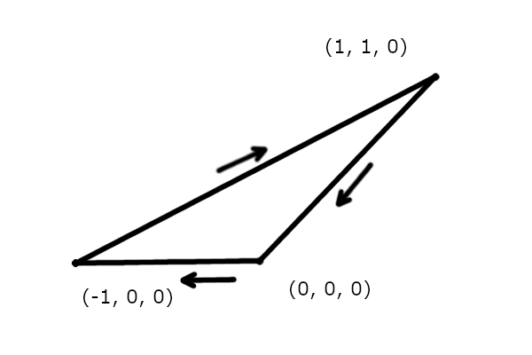

## Реализация примитивов: Вершина, Треугольник, Модель

Базовыми элементами (примитивами) в 3D-графике являются вершины, треугольники и модели. Они используются для описания геометрии и расположение объекта в 3D-пространстве. В моём движке они реализованны следующим образом:

#### Вершина (`Vertex`)

Вершина является основной точкой в 3D-пространстве. Она задаётся тремя координатами: *X*, *Y* и *Z*. Каждая вершина определяет положение точки в пространстве, которые, в свою очередь, могут быть использованы для построения более сложных структур, таких как плоскости.


#### Треугольник (`Triangle`)

Треугольник является совокупностью трёх вершин. Они используюься для описания 3D-моделей. Но, почему именно треугольники, а не, допустим, четырёхугольники? Всё очень просто, в тригонометрии есть подобное определение *"Через любые 3 точки в 3-х мерном простанстве, как бы они не распологались, всегда можно провести плоскось"*. Именно по этому в 3D-графике обычно и используются треугольники. В момент, когда мы задаём треугольник тремя вершинами очень важно соблюсти последовательность, а именно, нам нужно задавать его строго по часовой стрелке, что важно для корректного расчёта нормалей (Нормаль - вектор направления, перпендикулярный плоскости и указывает направление лицевой стороны треугольника). Конечно, мы можем и не придерживаться концепции задавать их именно по часово стрелке, но важно, что бы они все были заданы в одну сторону (но принято их задавать именно по часовой).



#### Модель (`Mesh`)

Модель является совокупностью множества треугольников, которые описывают геометрию объекта в 3D-пространстве. Она задаётся массивом треугольников, что позволяет описывать очень сложные объекты. Каждая модель может представлять отдельный объект в сцене и обрабатываться отдельно.


---

### Реализация

#### Структура `Vec3d` (`Vertex`)

```cpp
class Vec3d {
public:
    // 3D-координаты
    float x = 0, y = 0, z = 0;
    // Компонента для проекции (по умолчанию 1)
    float w = 1; // она нам пригодится позже

    // Конструктор по умолчанию
    Vec3d() = default;
    // Конструктор с одинаковыми значениями для x, y, z
    Vec3d(float xyz) : x(xyz), y(xyz), z(xyz) {}
    // Конструктор с отдельными значениями для x, y, z
    Vec3d(float _x, float _y, float _z) : x(_x), y(_y), z(_z) {}
};
```

#### Структура `Triangle`

```cpp
class Triangle {
public:
    // Вершины треугольника
    std::array<Vec3d, 3> p;

    // Конструктор по умолчанию
    Triangle() : p{ Vec3d(), Vec3d(), Vec3d() } {}
    // Конструктор с заданными вершинами
    Triangle(Vec3d p1, Vec3d p2, Vec3d p3) : p{ p1, p2, p3 } {}
};
```

#### Структура `Mesh`

```cpp
class Mesh {
public:
    // Конструктор с созданием куба
    Mesh() {
        m_triangles = {
            Triangle( Vec3d(0.0f, 0.0f, 0.0f),  Vec3d(0.0f, 1.0f, 0.0f),  Vec3d(1.0f, 1.0f, 0.0f) ),
            Triangle( Vec3d(0.0f, 0.0f, 0.0f),  Vec3d(1.0f, 1.0f, 0.0f),  Vec3d(1.0f, 0.0f, 0.0f) ),
            Triangle( Vec3d(1.0f, 0.0f, 0.0f),  Vec3d(1.0f, 1.0f, 0.0f),  Vec3d(1.0f, 1.0f, 1.0f) ),
            Triangle( Vec3d(1.0f, 0.0f, 0.0f),  Vec3d(1.0f, 1.0f, 1.0f),  Vec3d(1.0f, 0.0f, 1.0f) ),
            Triangle( Vec3d(1.0f, 0.0f, 1.0f),  Vec3d(1.0f, 1.0f, 1.0f),  Vec3d(0.0f, 1.0f, 1.0f) ),
            Triangle( Vec3d(1.0f, 0.0f, 1.0f),  Vec3d(0.0f, 1.0f, 1.0f),  Vec3d(0.0f, 0.0f, 1.0f) ),
            Triangle( Vec3d(0.0f, 0.0f, 1.0f),  Vec3d(0.0f, 1.0f, 1.0f),  Vec3d(0.0f, 1.0f, 0.0f) ),
            Triangle( Vec3d(0.0f, 0.0f, 1.0f),  Vec3d(0.0f, 1.0f, 0.0f),  Vec3d(0.0f, 0.0f, 0.0f) ),
            Triangle( Vec3d(0.0f, 1.0f, 0.0f),  Vec3d(0.0f, 1.0f, 1.0f),  Vec3d(1.0f, 1.0f, 1.0f) ),
            Triangle( Vec3d(0.0f, 1.0f, 0.0f),  Vec3d(1.0f, 1.0f, 1.0f),  Vec3d(1.0f, 1.0f, 0.0f) ),
            Triangle( Vec3d(1.0f, 0.0f, 1.0f),  Vec3d(0.0f, 0.0f, 1.0f),  Vec3d(0.0f, 0.0f, 0.0f) ),
            Triangle( Vec3d(1.0f, 0.0f, 1.0f),  Vec3d(0.0f, 0.0f, 0.0f),  Vec3d(1.0f, 0.0f, 0.0f) ),
	    };
    }

    // Метод для получения треугольников модели
    std::vector<Triangle> getTriangles() const;

private:
    // Треугольники модели
    std::vector<Triangle> m_triangles;
};
```