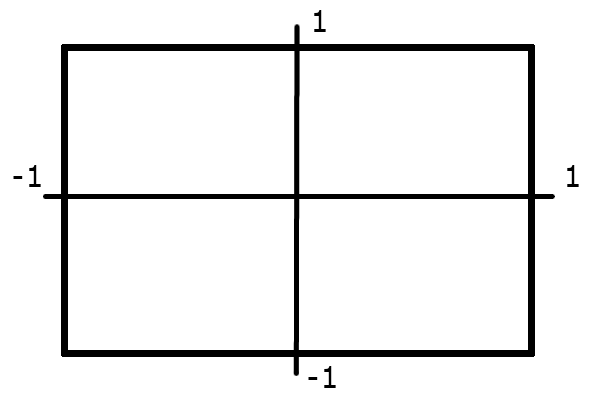

## Матрицы и матрица проекции

Матрицы играют ключевую роль в 3D-графике, так как они позволяют выполнять преобразования объектов в пространстве, такие как перемещение, вращение, масштабирование и проекцию. Матрица проекции — это особый тип матрицы, который используется для преобразования 3D-координат в 2D-координаты экрана, учитывая перспективу и соотношение сторон.

---

### Матрицы в 3D-графике

Матрица — это математическая структура, состоящая из строк и столбцов, которая используется для выполнения линейных преобразований. В 3D-графике чаще всего используются матрицы 4x4, так как они позволяют выполнять аффинные преобразования (перемещение, вращение, масштабирование) и проекцию.

#### Основные преобразования:

1. **Проекция (Projection)** — преобразование 3D-координат в 2D-координаты экрана.
2. **Масштабирование (Scaling)** — изменение размера объекта.
3. **Перемещение (Translation)** — изменение положения объекта в пространстве.
4. **Вращение (Rotation)** — поворот объекта вокруг осей X, Y или Z.

---

### Матрица проекции

Матрица проекции используется для преобразования 3D-координат в 2D-координаты экрана. Она учитывает перспективу, область видимости и соотношение сторон экрана. Матрица проекции преобразует координаты из пространства камеры в нормализованные координаты экрана. В 3д графике координаты на экране задаются от -1 до 1.



#### Основные параметры матрицы проекции:

1. **Область видимости и зависимость от оси Z**:

   - Общая видимсоть определяется разностью `near` и `far` (в данном случае `near = 1`, а `far = 10`, значит, разость равно **9**).Чем дальше объект от камеры, тем меньше он кажется. Это достигается за счёт деления координат на компоненту W (перспективное деление). Но, прежде чем делить на W нужно расчитать, насколько объект далеко от камеры, расчитывать мы будем по следующим формулам: $\frac{ZFar}{ZFar-ZNear}$; $\frac{ZFar \cdot ZNear}{ZFar-ZNear}$


2. **Масштабирование (нормализация)**:

- Учитывает соотношение сторон экрана (aspect ratio), чтобы объекты не искажались при отрисовке, так как координаты экрана у нас задаются теперь от -1 до 1, то нужно одну из сторон домножать на частное сторон исходного экрана. Но также не стоит забывать, что по отдалению объекта, он не только начинает уменьшаться, но и становится ближе к центру или к краю экрана, а значит нам проецировать его на экран исходя из того, как далеко он находится. Посмотрев на рисунок, мы можем увидеть прямой угол, а значит тут можно применить тангенс и, т.к. у нас получается 2 угла, то мы должны поделить наш угол обзора (FOV) на 2. В итоге мы получим формулу $\frac{1}{\tan(\frac{\theta}{2})}$


#### Расчитанная матрица проекции:

Разберём данную матрицу. Вспоминаем, что для оси *X* нам нужно применить **aspect ratio**(*высота экрана делённая на ширину*) и формулу с *тангенсом* из **3** пункта (ставим её в матрицу по индексом `0;0`), для оси *Y* только тангенс (стаивм под индексом `1;1`). А вот с осью *Z* всё немного сложнее, для неё у нас 2 формулы, которые мы вывели во **2** пункте, и нам их нужно как то вместить матрицу (по этому, 1 формулу ставим под индексом `3;3`, а вторую `4;3`). В матрице индексы указываются следующим образом: `строка;столбец`. И также стоит поставить **1** под индексом `3;4`.

$
\begin{bmatrix}
\left(\frac{n}{w}\right) \cdot \frac{1}{\tan(\theta / 2)} & 0 & 0 & 0 \\
0 & \frac{1}{\tan(\theta / 2)} & 0 & 0 \\
0 & 0 & \frac{Z_{far}}{Z_{far} - Z_{near}} & 1 \\
0 & 0 & \frac{-Z_{far} \cdot Z_{near}}{Z_{far} - Z_{near}} & 0
\end{bmatrix}
$

---

### Реализация

#### Структура `Mat4x4`

```cpp
class Mat4x4 {
public:
    // Матрица 4x4 (двумерный массив)
    std::array<std::array<float, 4>, 4> m;

    // Конструктор по умолчанию
    Mat4x4() = default;
    // Инициализация списком значений
    Mat4x4(std::initializer_list<std::initializer_list<float>> values) {
        int i = 0, j = 0;
	    for (const auto& row : values) {
	        for (const auto& val : row) {
	            m[i][j] = val;
	            j++;
	        }
		    i++;
		    j = 0;
    	}
    }

    // Матрица проекции
    static Mat4x4 projection(float fNear, float fFar, float fFov, float fAspectRatio) {
        // Преобразование угла обзора в радианы
        float fFovRad = 1.f / tanf(fFov * 0.5f * (180.f / 3.14159f));
        return Mat4x4{
            { fAspectRatio * fFovRad,  0,        0,                                 0 },
            { 0,                       fFovRad,  0,                                 0 },
            { 0,                       0,        fFar / (fFar - fNear),             1 },
            { 0,                       0,        (-fFar * fNear) / (fFar - fNear),  0 }
        };
    }
};
```

#### Добавим в `Vec3d` и `Triangle` возможность умножения на матрицу

```cpp
// Vec3d
// Добавляем в класс перегрузку опрератора (актуально для c++), в других языках можно реализовать обычным методом

// Умножение вектора на матрицу 4x4
Vec3d operator*(const Mat4x4& mat) {
    Vec3d result;
    result.x = x * mat.m[0][0] + y * mat.m[1][0] + z * mat.m[2][0] + w * mat.m[3][0];
    result.y = x * mat.m[0][1] + y * mat.m[1][1] + z * mat.m[2][1] + w * mat.m[3][1];
    result.z = x * mat.m[0][2] + y * mat.m[1][2] + z * mat.m[2][2] + w * mat.m[3][2];
    result.w = x * mat.m[0][3] + y * mat.m[1][3] + z * mat.m[2][3] + w * mat.m[3][3];
    return result;
}

// также не забываем, что после проекции нужно сделать её перспективной, поделив на компоненту W. По этому добавляем нужный метод

// Деление x, y, z на w (для проекции)
void projectionDiv() {
    x /= w;
    y /= w;
    z /= w;
}
```

```cpp
// Triangle

// Повторяем те же методы и для класса треугольника, так как с помощью него мы изменяем векторы и добавляем дополнительные

// Проецирование треугольника (деление на w)
void projectionDiv() {
    for (size_t i = 0; i < 3; i++) {
        // Деление координат вершины на w
        p[i].projectionDiv();
    }
}

// Масштабирование треугольника для отображения на экране
void scalingToDisplay() {
    // Перемещение по оси X
    translateX(1.f);
    // Перемещение по оси Y
    translateY(1.f);
    // Масштабирование по оси X
    scaleX(0.5f * 1920);
    // Масштабирование по оси Y
    scaleY(0.5f * 1080);
}

// Перемещение треугольника по оси X
void translateX(float f) { for (auto& v : p) { v.x += f; } }
// Перемещение треугольника по оси Y
void translateY(float f) { for (auto& v : p) { v.y += f; } }
// Перемещение треугольника по оси Z
void translateZ(float f) { for (auto& v : p) { v.z += f; } }

// Масштабирование треугольника по оси X
void scaleX(float f) { for (auto& v : p) { v.x *= f; } }
// Масштабирование треугольника по оси Y
void scaleY(float f) { for (auto& v : p) { v.y *= f; } }
// Масштабирование треугольника по оси Z
void scaleZ(float f) { for (auto& v : p) { v.z *= f; } }

// Умножение треугольника на матрицу трансформации
Triangle operator*(const Mat4x4& mat) {
    Triangle result = *this;
    for (size_t i = 0; i < 3; i++) {
        result.p[i] = p[i] * mat;
    }
    return result;
}

// Также сделаем оператор с присваиванием для удобства использования
// Умножение треугольника на матрицу с присваиванием
Triangle& operator*=(const Mat4x4& mat) {
    for (size_t i = 0; i < 3; i++) {
        p[i] = p[i] * mat;
    }
    return *this;
}
```