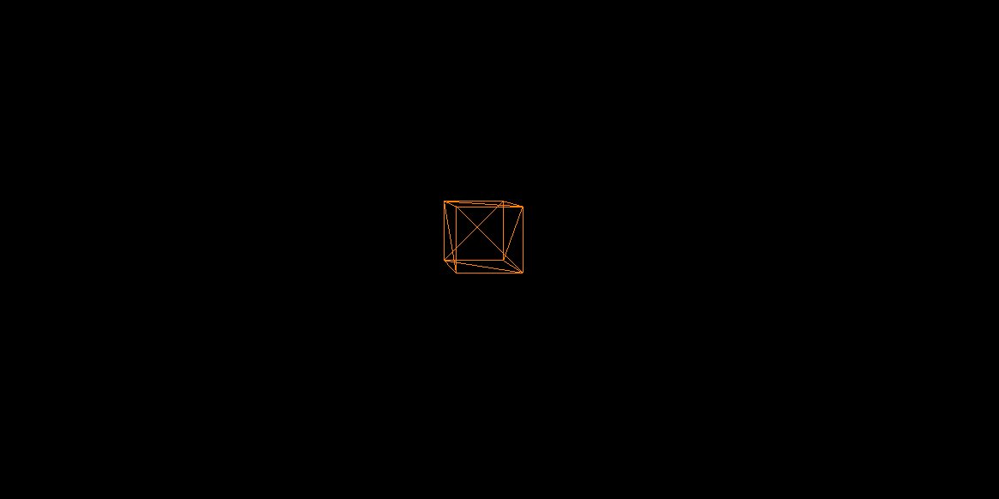

## Проецирование и рендер

#### Общий алгоритм проекции

Пройдёмся по алгоритму отображения 3D модели на 2D экран. Оно состоит из нескольких этапов:

1. **Преобразование вершин** через матрицу проекции.
2. **Масштабирование** координат под разрешение экрана.
3. **Смещение** для корректного позиционирования.

---

### Реализация

#### Структура `Render`

```cpp
class Render {
public:
    // Конструктор
    Render();

    // Добавление модели в список для рендеринга
    void addMesh(Mesh& mesh) {
        m_renderMeshes.emplace_back(&mesh);
    }
    // Обновление матрицы проекции
    void update() {
    	matProj = Mat4x4::projection(0.1f, 1000, 90, 800.f / 1200.f);
    }
    // Отрисовка сцены
    void render(sf::RenderWindow& window) {
        // Треугольники после проекции
        std::vector<Triangle> projectedTriangles;

        // Буферы для отрисовки треугольников и рёбер
        sf::VertexArray drawingEdges(sf::PrimitiveType::Lines);
        // Цвет рёбер
        sf::Color edgeColor(255, 128, 0);

        // Обработка всех моделей
        for (auto& mesh : m_renderMeshes) {
            // Получение треугольников
            std::vector<Triangle> triangles = mesh->getTriangles();

            // Обработка каждого треугольника
            for (auto& triangle : triangles) {
                // Копируем треугольник модели для дальнейших преобразований
                Triangle projectedTriangle = triangle;

                // Применение матрицы проекции
                projectedTriangle *= matProj;

                // Перспективная коррекция и масштабирование треугольника
                projectedTriangle.projectionDiv();
                projectedTriangle.scalingToDisplay();

                // Добавление треугольника в список
                projectedTriangles.emplace_back(projectedTriangle);
            }
        }

        // Отрисовка объекта
        for (const auto& triangle : projectedTriangles) {
            // Отрисовка рёбер
            drawingEdges.append(sf::Vertex{sf::Vector2f(triangle.p[0].x, triangle.p[0].y), edgeColor});
            drawingEdges.append(sf::Vertex{sf::Vector2f(triangle.p[1].x, triangle.p[1].y), edgeColor});
            drawingEdges.append(sf::Vertex{sf::Vector2f(triangle.p[1].x, triangle.p[1].y), edgeColor});
            drawingEdges.append(sf::Vertex{sf::Vector2f(triangle.p[2].x, triangle.p[2].y), edgeColor});
            drawingEdges.append(sf::Vertex{sf::Vector2f(triangle.p[2].x, triangle.p[2].y), edgeColor});
            drawingEdges.append(sf::Vertex{sf::Vector2f(triangle.p[0].x, triangle.p[0].y), edgeColor});
        }

        window.draw(drawingEdges);
    }

private:
    // Список моделей для рендеринга
    std::vector<Mesh*> m_renderMeshes;

    // Камера
    Camera& m_camera;

    // Матрица проекции
    Mat4x4 matProj;
};
```

#### Импорт в основной класс

В основном классе `Engine` нашего движка нужно создать объекты реализованных классов. С камерой всё просто, мы создаём её с нужной позицией и передаём в конструктор `Render` при его создании. После создания объекта рендера, нам нужно использовать его метод `update` в методе `update` класса `Engine`, а метод `render` в методе `draw`, передав в него наше окно *SFML*.

#### Результат

В итоге, после всех проделанных манипуляций мы получаем проекцию куба. Это далеко не финальный результат. В данный движок предстоит добавить возможность изменять объект с помощью матриц (перемещение, вращение, масштабирование), добавить камеру и освещение (перед этим добавив заливку треугольников с возможностью выбора цвета). Следующим этапом стоит добавить отсечение треугольников находящихся за пределами видимой области, а также реализовать наложение текстур. Со всеми этими доработками можно ознакомиться, изучив исходный код моего движка, который достаточно прост в понимании.

